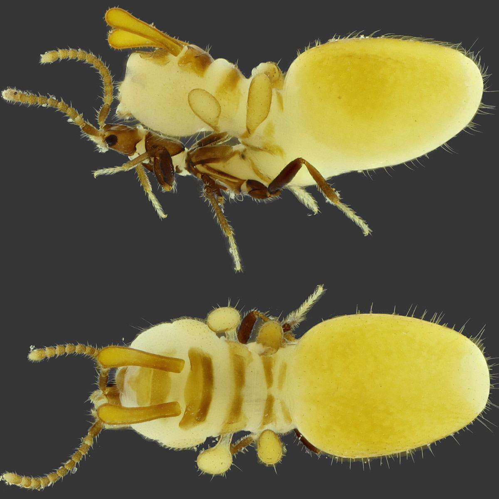

Я завтра закончу этот сериал про землекопов, но сегодня не могу удержаться и не рассказать о невероятном новом открытии, которое сделали два бразильца в Австралии. 

Неудивительно, что этот жук был открыт только в 21м веке. Дело в том, что на спинной поверхности его тела имеется нарост, который довольно подробно имитирует термита, больше самого жука по размеру. Поскольку живет он в термитнике, естественно, что ученые были слепы к его присутствию - как и сами термиты, которых этот новый жук, судя по всему, обкрадывает пользуясь невероятной мимикрией. Назвали Austrospirachtha carrijoi. 

Надо сказать, что большинство термитов и так ничего не видят, в том числе и вот эти австралийские. Но у них хороший нюх и осязание. Похоже, что муляж, который вырос на спине у жуков, достаточен чтобы обмануть осязание. Авторы предполагают, что впридачу выделяются летучие молекулы, которые имитируют запах термита. Разглядите: найдите голову, ноги и антенны жука, потом двигайтесь взглядом назад, убедитесь что видите его желтое брюшко, а дальше просто: на спинной поверхности вперед торчит продолжение этого вот муляжа. 

Это похоже на некоторые хэллоуинские костюмы, когда человек надевает на себя ростовую куклу, которая будто бы держит его собственную голову в руках, знаете? 

Зачем все это нужно? Пока неясно, но напрашивается гипотеза о нахлебничестве. Термиты — крайне успешные собиратели калорий. Каста рабочих имеет обязанность: по первому требованию накормить представителей других каст, и вот, жуки этим видимо пользуются.

{{}}